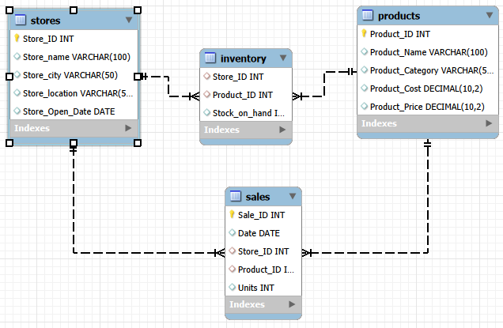
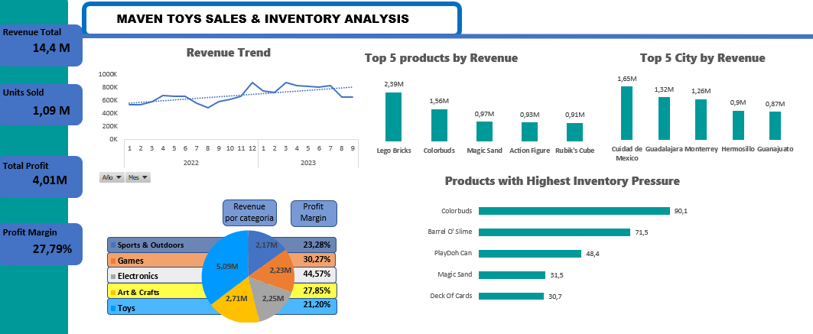

# ANÁLISIS DE INVENTARIO Y VENTAS DE JUGUETES MAVEN

## Descripción del Proyecto

Este proyecto analiza el rendimiento comercial de Maven Toys, una cadena ficticia de jugueterías en México.

Utilizando SQL para la extracción y análisis de datos y Excel para la visualización, se desarrolló un dashboard ejecutivo para identificar tendencias de ventas, productos más rentables, categorías con mejor desempeño y posibles riesgos de inventario.

## Objetivos del Análisis

- ¿Cómo evolucionan los ingresos a lo largo del tiempo?
- ¿Qué categorías generan más ingresos?
- ¿Qué productos son los más rentables?
- ¿Qué ciudades generan mayor facturación?
- ¿Qué productos presentan mayor riesgo de rotura de stock?
- ¿Cuál es el margen de beneficio del negocio?
  
## Metodología
1. Validación y limpieza de datos.
2. Análisis exploratorio (EDA).
3. Desarrollo de consultas SQL.
4. Construcción de KPIs.
5. Diseño del dashboard en Excel.
6. Elaboración de conclusiones y recomendaciones.

## Dataset

El análisis se realizó sobre cuatro tablas relacionales:

- Sales: Transacciones de venta
- Products: Información de productos
- Stores: Información de tiendas
- Inventory: Niveles de inventario

## Modelo de Datos

## Dashboard

## KPIs Analizados

Durante el análisis se desarrollaron los siguientes indicadores clave de rendimiento (KPIs):

- Revenue Total: 14.444.572,35$
- Units Sold: 1.090.565 unidades
- Total Profit: 4.014.029$
- Profit Margin: 28%

Estos indicadores permiten evaluar el rendimiento global del negocio y entender el contexto del negocio.

## Análisis Realizados

### Revenue Trend

El análisis temporal de los ingresos muestra una tendencia general alcista durante el periodo analizado, pasando de niveles cercanos a los 500.000$ mensuales a superar los 800.000$ en los mejores meses registrados.

A pesar de algunas fluctuaciones puntuales, la evolución del revenue refleja un crecimiento sostenido de la actividad comercial, indicando una mejora progresiva en el rendimiento del negocio.

La presencia de picos de ventas en determinados meses podría sugerir efectos de estacionalidad o campañas comerciales que merecerían un análisis más profundo.

### Revenue por Categoría

Se comparó el rendimiento económico de las cinco categorías de productos con el objetivo de identificar cuáles generan una mayor contribución a los ingresos totales. Con ello, se vio que la que más factura es la categoria de Juguetes, con una cifra de 5.093.241$ siendo practicamente el doble de las otras categorias por separado. 
Este dato nos da información clave ya que, nos da a entender que es la principal fuente de ingresos. La dependencia en una unica categoria hace que suponga un riesgo por lo que seria conveniente diversificar las fuentes de ingresos y buscar alternativas para potenciar las demas lineas de productos.
### Top Productos por Revenue

Se identificaron los productos con mayor facturación siendo el primero un producto dentro de la categoria Juguetes y ese producto es 'Lego Bricks' con una facturación de 2.388.882,63$ seguido de 'Colorbuds' dentro de la categoria de electronica, con una facturación de 1.564.476,32$. Estos productos son fundamentales en el funcionamiento del negocio por lo que es muy importante un buen seguimiento de su stock para que no pueda haber ninguna rotura de stock. Por otra parte seria conveniente potenciar otros productos y analizar sus oportunidades de crecimiento para diversificar el riesgo del negocio.

### Revenue por Ciudad

Se realizó un análisis geográfico de los ingresos para detectar las ciudades con mejor rendimiento comercial y comprender la distribución territorial de las ventas. Tras el anlaisis se vio que hay una enorme diferencia en cuanto a facturación entre las diferentes ciudades en las que opera la empresa, siendo la mejor ciudad Ciudad de Mexico con una cifra de 1.649.492,01$ y tras ella las principales ciudades metropolitanas del país. Los resultados sugieren que la empresa debería priorizar las ciudades con mayor volumen de ventas, sin descuidar oportunidades de crecimiento en mercados secundarios.

### Inventory Pressure Analysis

Para evaluar el riesgo potencial de rotura de stock, uno de los objetivos principales del estudio, se desarrolló un indicador de presión de inventario basado en la relación entre unidades vendidas y stock disponible.
Este indicador nos muestra productos que tienen una velocidad de venta significativamente superior a la disponibilidad de inventario, lo que podría provocar problemas de abastecimiento si la demanda continúa aumentando.
Los resultados muestran que Colorbuds presenta la mayor presión sobre inventario (90,1), seguido por Barrel O' Slime (71,5) y Play-Doh Can (43,4).
Lo que se quiere transmitir con este ratio es que en el caso de colorbuds el volumen de ventas acumulado en el periodo estudiado es 90 veces superior al stock disponible.
La empresa debería priorizar la reposición de estos artículos y monitorizar periódicamente este indicador para evitar pérdidas de ventas provocadas por falta de stock.

## Principales Hallazgos

Los resultados obtenidos durante el análisis permitieron identificar varios aspectos relevantes para el negocio:

- La empresa presenta una tendencia general positiva en sus ingresos durante el periodo analizado siendo su facturación total de 14,44M$ en el periodo analizado.
- La categoría Toys generó más de 5M$ en ingresos, siendo la principal línea de negocio. Se aconseja diversificar y potenciar otras lineas de negocio para minimizar el riesgo de dependencia.
- Lego Bricks fue el producto con mayor revenue, superando los 2,3M$.
- Las ventas se concentran en las grandes ciudades metropolitanas, lideradas por Ciudad de Mexico con aproximadanamente 1,65M$.
- Colorbuds presentó la mayor presión de inventario, indicando un posible riesgo de rotura de stock que debe ser atendido de manera prioritaria, más aún sabiendo que Colorbuds es el segundo producto con mayor facturación en la empresa lo que supone que una falta de stock podría provocar grandes perdidas en ventas.
- El margen de beneficio global alcanzó aproximadamente el 28%, lo que quiere decir que por cada dolar que facture la empresa 0,28$ es beneficio. Reflejando así, una rentabilidad sólida del negocio.
  ## Recomendaciones de Negocio

A partir de los resultados obtenidos se proponen las siguientes acciones:

- Priorizar la reposición de productos con elevada presión de inventario, especialmente Colorbuds y Barrel O' Slime.
- Mantener una supervisión continua de los productos con mayor facturación para minimizar posibles pérdidas derivadas de roturas de stock.
- Potenciar las categorías con menor participación en ingresos para reducir la dependencia de la categoría Toys.
- Investigar posibles patrones estacionales en las ventas como potenciar picos y disminuir caidas.
## Herramientas Utilizadas

- MySQL
- MySQL Workbench
- Excel
- Power Query
- GitHub

## Habilidades Demostradas

A través de este proyecto se pusieron en práctica las siguientes competencias:

- SQL
- Joins
- Aggregations
- Common Table Expressions (CTEs)
- Data Cleaning
- Exploratory Data Analysis (EDA)
- KPI Development
- Dashboard Design
- Business Analysis
- Data Visualization

## Autor

Proyecto desarrollado por Javier Alonso Gómez como parte de su portfolio de análisis de datos.

GitHub: https://github.com/jalonsogomezz-maker

## Fuente de Datos

Dataset obtenido de Maven Analytics Data Playground:

https://mavenanalytics.io/data-playground/mexico-toy-sales
